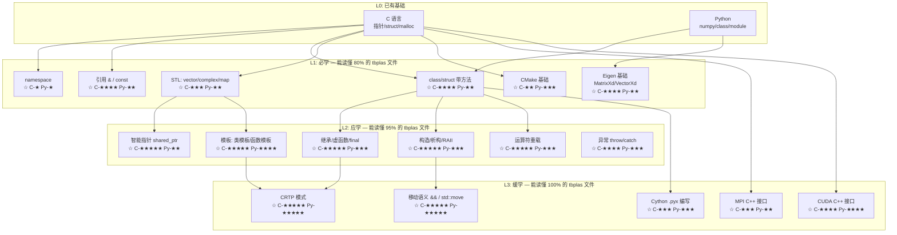

<!--
 * @Author       : Yulong Wang
 * @Date         : 2026-06-22 16:51:43
 * @LastEditors  : Yulong Wang
 * @LastEditTime : 2026-06-22 16:51:43
 * @FilePath     : /.agents/home/wyl/project/knowledge/computer_science/cpp_for_tbplas/12_field_map.md
 * @Description  :
-->
---
document_type: field_map
schema_version: v1.0
field: "C++ 编程（面向 tbplas 源码）"
last_updated: 2026-06-22
---

# 12 领域地图 / C++ 学习路径（以 tbplas 为锚点）

Last updated: 2026-06-22

## 0. 阅读说明

这不是 C++ 百科全景图。这是一张**以 tbplas 源码为锚点的 C++ 概念依赖地图**。每个节点给出了：
- 它在 tbplas 中的具体位置
- 它依赖的前置概念
- C 和 Python 用户分别的心智迁移难度（★=熟悉，★★★★★=全新范式）

## 1. 概念依赖拓扑图

## 2. 按 tbplas 文件组织的阅读顺序

### 第一梯度：C++ 的"C 面"（最小认知负担）

| 阅读顺序 | 文件 | 关键 C++ 概念 | 行数 | 为什么从这里开始 |
|:---:|------|------|:---:|------|
| 1 | `base/datatypes.h` | `using` 类型别名、`std::complex`、`std::vector` | ~30 | 只有类型定义，无逻辑。C 用户唯一的新东西是 `using` 替代 `typedef` |
| 2 | `base/consts.h` | `constexpr`、`namespace` | ~20 | 物理常数定义，内容熟悉，重点看 C++ 怎么组织常量 |
| 3 | `base/lattice.h` | `class` 定义、`const &` 参数、Eigen 类型 | ~50 | 第一个"真正的 class"，但数据为主方法为辅 |
| 4 | `base/funcs.h` | 函数声明、`std::vector` 参数传递 | ~30 | 纯函数接口，和 C 的 `.h` 最接近 |
| 5 | `base/parallel.h` | `namespace` 嵌套、MPI 包装 | ~30 | MPI 概念熟悉，看 C++ 怎么包装 C 接口 |

### 第二梯度：C++ 的核心范式

| 阅读顺序 | 文件 | 关键 C++ 概念 | 行数 | 为什么在这里 |
|:---:|------|------|:---:|------|
| 6 | `base/utils.h` + `utils.cpp` | RAII（Timer 类）、构造函数/析构函数 | ~40+30 | Timer 是 RAII 的最小完美示例 |
| 7 | `base/io_base.h` | 继承、`enum class`、虚函数 | ~60 | 第一个继承层次，IO 的抽象基类 |
| 8 | `base/io_text.h` + `io_text.cpp` | 继承实现、`override` | ~40+60 | 看派生类怎么实现基类接口 |
| 9 | `base/results.h` | CRTP 模式、模板 | ~80 | 第一个模板+CRTP，但逻辑简单（只是格式化输出） |
| 10 | `builder/sample.h` | 移动语义、`shared_ptr`、运算符重载 | ~100 | tbplas 中 C++ 内存管理最复杂的文件 |

### 第三梯度：核心算法（最终目标）

| 阅读顺序 | 文件 | 关键 C++ 概念 | 行数 | 为什么是终点 |
|:---:|------|------|:---:|------|
| 11 | `tbpm/kubo_bastin.h` | 模板方法、Eigen 运算、OpenMP | ~270 | Kubo-Bastin 算法的完整 C++ 实现 |
| 12 | `tbpm/solver.h` | 类模板、多后端宏、复杂数值逻辑 | ~1000 | tbplas 中最复杂的文件 |
| 13 | `python/builder/sample.pyx` | Cython 语法、C++ 类包装 | ~50 | 理解 C++ → Python 的桥接 |

## 3. C ↔ C++ ↔ Python 核心差异速查表

| 概念 | C 的做法 | C++ 的做法 | Python 的做法 | tbplas 实例 |
|------|------|------|------|------|
| **类型别名** | `typedef double real;` | `using real = double;` | 不需要（动态类型） | `base/datatypes.h:16` |
| **数组** | `double* arr = malloc(n*sizeof(double));` | `std::vector<double> arr(n);` | `arr = [0.0]*n` | 各处的 `vector<complex>` |
| **复数** | `double complex` (C99) | `std::complex<double>` | `complex` 内置 | `base/datatypes.h` |
| **模块化** | `extern` + 前缀命名 | `namespace tbplas { ... }` | `import module` | `base/lattice.h` 的 `namespace` |
| **结构体** | `struct Point { double x,y; };` | `struct Point { double x,y; double norm() const; };` | `class Point: def norm(self):` | `base/lattice.h` 的 Lattice 类 |
| **参数传递** | `void f(double* x)` | `void f(const vector<double>& x)` | `def f(x):` | `base/lattice.h:30` 的 `const Matrix3d&` |
| **内存管理** | `malloc` / `free` | RAII + `shared_ptr` / `unique_ptr` | 垃圾回收 | `builder/sample.h:38` 的 `shared_ptr` |
| **泛型** | `void*` + 函数指针 / 宏 | `template <typename T>` | duck typing | `tbpm/solver.h:52` 的 `template<model_t>` |
| **多态** | 函数指针表 | `virtual` 函数 + 继承 | 鸭子类型 / ABC | `tbpm/backend.h` 的 `AbstractTBPM` |
| **错误处理** | `return -1;` / `errno` | `throw std::runtime_error("msg");` | `raise ValueError("msg")` | `tbpm/utils.cpp:53` |

## 4. 方法谱系：计算物理中的 C++ 用法模式

tbplas 代表的是**计算物理中 C++ 的一种特定流派**：

| 维度 | tbplas 的选择 | 替代流派 |
|------|------|------|
| **线性代数** | Eigen（header-only，表达力强） | Armadillo、BLAS 裸调用 |
| **内存管理** | `shared_ptr` + RAII | 手动 new/delete、对象池 |
| **泛型** | 模板（编译期多态） | 虚函数（运行时多态） |
| **并行** | OpenMP + MPI + CUDA 三后端 | 只用 MPI |
| **Python 绑定** | Cython | pybind11、SWIG、ctypes |
| **构建系统** | CMake | Makefile、Bazel、meson |
| **C++ 标准** | C++17 | C++11、C++20 |

理解这个流派选择，就不会被网上五花八门的 C++ 教程带偏——你需要学的正好是这个流派用到的子集。
