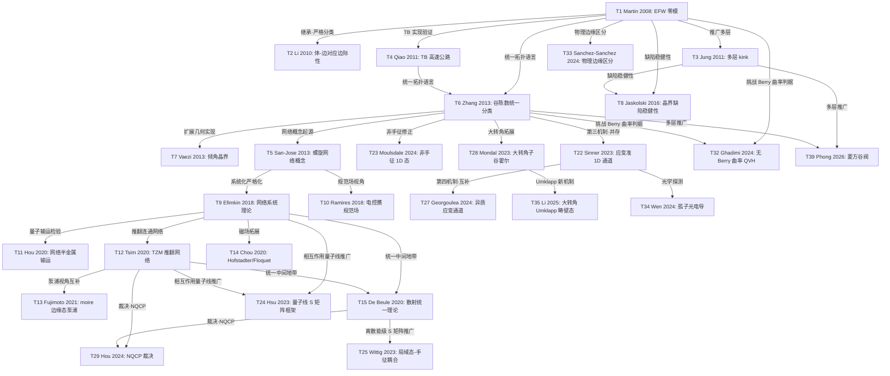

<!--
 * @Author       : Yulong Wang
 * @Date         : 2026-08-19 23:24:44
 * @LastEditors  : Yulong Wang
 * @LastEditTime : 2026-08-20 11:56:01
 * @FilePath     : /.agents/home/wyl/project/knowledge/physics/twisted_bilayer_graphene/Phase_S/appendix_B_theory.md
 * @Description  : Phase S report.md 附录 B — 理论解释谱系演进树（2008→2026）
-->
<!--
 * @Author       : AI 组装 (run-task S-APP-B)
 * @Date         : 2026-08-19
 * @Description  : Phase S report.md 附录 B — 理论解释谱系演进树（S-APP-B）
-->

# 附录 B：理论解释谱系 — Edge State 理论演进树（2008→2026）

> **状态**: 初稿待人类修订（S-APP-B，2026-08-19）
> **数据源**: `cards.md` Q2 节（T1–T39 理论卡片）+ 已有精读 38 篇（`note/theory/`、`note/theory/`、`note/theory/`、`note/theory/`）
> **QC 声明**: 全部数字已逐一核对。39 篇理论论文**全部**有原文 PDF（`reference/pdfs/`，pdftotext 提取后 grep；2026-08-19 首批 24 篇、08-20 补齐 12 篇 + 最后 3 篇），核对通过者标 `pdf✓` 与 📜Q。与卡片/精读不符处见 §B.5 更正日志。
> **范围**: 覆盖 cards.md Q2 全部 39 张理论卡片（T1–T39）；R1–R4 四篇综述仅在 §B.1 总览中作为时代锚点提及，不计入节点。
> **证据分级**: 📜Q = 原文文字直接支持（附位置）/ 📊F = 读图估算 / 💭I = 推断（不得进入 report 正文）。

---

## B.1 演进树总览

### B.1.1 四个时代（卡片 2.6 小结精炼）

```
2008–2013 奠基: 拓扑保护机制确立
  谷 Chern 数框架 → EFW/LSW/倾角晶界统一理解
  核心判据: ΔC_v ≠ 0 → 拓扑保护边界模
  [R1–R4 综述为 2020–2023 时代的回顾性锚点]

2013–2020 网络范式兴起
  螺旋网络 (T5→T9) → 网络散射细化 (T15)
  核心张力: 网络 vs 独立 1D 通道

2020–2024 TZM 挑战与裁决
  TZM 推翻网络 (T12) → 散射统一 (T15) → NQCP 裁决 (T29)
  补充: 非手征态 (T23)、局域态 (T25)、SOC/关联扩展
  核心共识: 通道独立传播 + NQCP 近量子化平台

2024–2026 超越网络: 范式扩展
  大转角 (T28/T35) + 应变 (T22/T27) + 超导界面 (T31/T36/T38)
  + 菱方多层推广 (T39) + 物理边缘区分 (T33)
  核心趋势: 超出小转角/双层/单粒子的传统范式
```

### B.1.2 演进树（关系图）



关系图例（仅三类）:
- **继承** →: 后作采用并发展前作框架（如 T1→T2、T5→T9）
- **推翻** →: 后作否定前作核心假设（如 T9→T12）
- **并存/互补** →: 补充或并行，不否定前作（如 T23、T25、T13 与 T12）

---

## B.2 四时代节点详解

> 每个节点三要素: **核心假设** / **关键预言** / **已知局限**。来源标记: `cards` = cards.md；`rev:文件` = 精读；`pdf✓` = 数字已逐字核对原文 PDF。

### B.2.1 奠基: 拓扑保护机制确立（2008–2013）

**T1 Martin, Blanter & Morpurgo, PRL 100, 036804 (2008)** ★ `cards, rev:theory/paper_review_T01_martin2008_prl.md, pdf✓`

- **核心假设**: BLG + 符号反转的层间偏置（voltage kink）→ 体能隙在 $V=0$ 处闭合-重开 → 拓扑相变 → 畴壁束缚手征 1D 零模；2-band 模型仅在 $V \ll t_\perp$ 有效 📜Q
- **关键预言**: 每谷每自旋 2 条零模、两谷反向传播（"two zero modes per kink per valley per spin"）📜Q；谷过滤效应 📜Q；弹道电导 $4e^2/h$ 💭I⚠️（两谷×两模×$e^2/h$ 推演，原文未出现该字符串）
- **已知局限**: 要求偏置变化平滑（避免谷间散射）📜Q；单粒子图像；2008 年实验实现分裂栅挑战大 📜Q

**T2 Li, Morpurgo, Büttiker & Martin, PRB 82, 245404 (2010)** `cards, rev:theory/paper_review_T02_li2010_prb.md, pdf✓`

- **核心假设**: 单谷哈密顿量中传统体-边对应不普适（marginal）——单谷拓扑荷仅对畴壁有保护意义 📜Q
- **关键预言**: 畴壁两侧谷陈数**差** $\Delta C_v$（而非单侧 $C_v$）才是稳健拓扑量
- **已知局限**: 单谷框架本身排除谷间散射——真实缺陷下的适用边界未闭合

**T3 Jung, Zhang, Qiao & MacDonald, PRB 84, 075418 (2011)** ★ `cards, rev:theory/paper_review_T03_jung2011_prb.md, pdf✓`

- **核心假设**: 多层石墨烯畴壁承载谷霍尔 kink 态，对畴壁取向不敏感（区别于边缘态）📜Q
- **关键预言**: 1D 模式数 ∝ 层数 $N$（ABC 三层每谷 3 条 1D 模 📜Q；通道数 = 两侧谷霍尔电导差 📜Q）
- **已知局限**: 连续模型在层数不同的界面处可能失效 📜Q

**T4 Qiao, Jung, Niu & MacDonald, Nano Lett. 11, 3453 (2011)** ★ `cards, rev:theory/paper_review_T04_qiao2011_nanolett.md, pdf✓`

- **核心假设**: AB/BA 畴壁 = "电子高速公路"——原子尺度 TB 模型可实现拓扑 1D 通道
- **关键预言**: 畴壁态在真实原子结构中稳健存在
- **已知局限**: 仅 AB/BA 堆叠壁，未覆盖 EFW 全部情形

**T6 Zhang, MacDonald & Mele, PNAS 110, 10546 (2013)** ★ `cards, rev:theory/paper_review_T06_zhang2013_pnas.md, pdf✓`

- **核心假设**: 谷陈数统一分类——EFW 与 LSW 的谷陈数变化同为 $\Delta N_\nu = \pm 2$ 📜Q，两者拓扑等价
- **关键预言**: EFW 与 LSW 保护相同数量的边界模（各一对同向手征模 📜Q）；补偿畴壁（堆叠+电场同时反号）完全无隙内模 📜Q——解释 Ju 2015 与 Li 2016 观测到相同 $4e^2/h$ 💭I⚠️
- **已知局限**: 分类框架止于能带拓扑，无序/关联效应未纳入

**T7 Vaezi, Liang, Ngai, Yang & Kim, PRX 3, 021018 (2013)** ★ `cards, rev:theory/paper_review_T07_vaezi2013_prx.md, pdf✓`

- **核心假设**: 晶格取向变化（倾角晶界）同样产生 $\Delta C_v \neq 0$ → 承载拓扑边缘态 📜Q
- **关键预言**: 倾角晶界网络可作为拓扑边缘态的实验平台 📜Q
- **已知局限**: 依赖栅控多层石墨烯中倾角晶界的实验成像

**T8 Jaskólski et al., Nanoscale 8, 6079–6084 (2016)** `rev:theory/paper_review_T08_jaskolski2016_nanoscale.md, pdf✓`（Q3 映射表条目，Q2 无卡片）

- **核心假设**: 原子尺度缺陷（八边形-双五边形线缺陷）不破坏畴壁隙内态 📜Q
- **关键预言**: 栅压极性反转改变隙内态数目 → 沿晶界电导不对称 📜Q（实验可测）
- **已知局限**: 晶界几何特殊（zigzag 方向缺陷线），普适性有限

### B.2.2 网络模型时代（2013–2020）

**T5 San-Jose & Prada, PRB 88, 121408(R) (2013)** ★ `cards, rev:theory/paper_review_T05_sanjose2013_prb.md, pdf✓`

- **核心假设**: mTBG + 偏压 → AB/BA 区域谷陈数反号 → 畴壁螺旋模形成连通导电网络（可编程，类 Chalker-Coddington）
- **关键预言**: 莫尔能标 $E_M \approx 88\,\text{meV}\times\theta(\text{deg})$ 📜Q；100 nm 莫尔周期阈值偏压 ≈45 meV 📜Q；吸附原子可选择性阻断单条链接（开关功能）
- **已知局限**: 依赖谷守恒（对谷间散射敏感）；理想周期莫尔假设；"设计原则"而非定量预言

**T9 Efimkin & MacDonald, PRB 98, 035404 (2018)** ★ `cards, rev:theory/paper_review_T09_efimkin2018_prb.md, pdf✓`

- **核心假设**: 连续模型投影到 2-band 子空间 → 畴壁 = Jackiw-Rebbi 零模；AA 节点 $3\times3$ 幺正 $S$ 矩阵连通（三角网络对称性约束，由角度 $\alpha$ 参数化）📜Q → 无隙网络能带
- **关键预言**: 网络能带能标 $\varepsilon_L = 2\pi\hbar v/L$（$\theta=0.245°$ 时 ≈72 meV 📜Q）；态密度在能量上周期振荡、每周 1 零点（Dirac 点）+ 1 发散（van Hove）📜Q，DoS 周期为 $\varepsilon_L/3$（≈20 meV 📜Q）
- **已知局限**: 假设 AA 节点连通——被 T12 挑战；未考虑同一链路两条螺旋模间散射、无序、温度

**T10 Ramires & Lado, PRL 121, 146801 (2018)** `cards, rev:theory/paper_review_T10_ramires2018_prl.md, pdf✓`

- **核心假设**: 微小角 TBG 中偏压诱导有效赝规范场（类 Peierls 替换）📜Q
- **关键预言**: 畴壁区域出现赝朗道能级（pLL）📜Q；赝磁场机制要求 $U < t_\perp$ 📜Q
- **已知局限**: 未连接输运实验的具体参数空间

**T11 Hou, Ren, Quan, Jung, Ren & Qiao, PRB 101, 201403(R) (2020)** `cards, rev:theory/paper_review_T11_hou2020_prb.md, pdf✓`

- **核心假设**: 相反谷陈数绝缘畴壁网络可用量子输运直接模拟
- **关键预言**: 网络在电荷中性点附近呈**半金属性、Dirac 色散**、态局域于畴壁 📜Q；锯齿边缘纳米带量子化电导、弱无序稳健 📜Q
- **已知局限**: 三叉边缘有限尺寸能隙（绝缘）——边缘终端敏感

**T14 Chou, Wu & Das Sarma, PRR 2, 033271 (2020)** `cards, rev:theory/paper_review_T14_chou2020_prr.md, pdf✓`

- **核心假设**: 三角网络模型 + 磁场
- **关键预言**: Hofstadter 蝴蝶谱 + 低能 Floquet 拓扑绝缘体实现 📜Q
- **已知局限**: 网络模型框架内（继承 T9 假设）

**T15 De Beule, Dominguez & Recher, PRL 125, 096402 (2020)** ★ `cards, rev:theory/paper_review_T15_debeule2020_prl.md, pdf✓`

- **核心假设**: AA 节点双通道散射（$C_3 + C_2\mathcal{T}$ 对称性约束），无前向散射时 $S$ 矩阵由单参数 $\phi\in[0,\pi/2]$ 决定
- **关键预言**: $\phi=0$ → 1D 手征 ZZ 模（对应 TZM）；$\phi=\pi/2$ → 赝朗道能级 📜Q——网络图景与 TZM 图景是同一散射结构的两极限；平行 ZZ 链耦合 → 温度稳健的 AB 振荡，交叉耦合 → 温度敏感的 SdH 振荡
- **已知局限**: $\phi$ 为唯象参数，未从微观模型导出；未含晶格弛豫修正

**T16 Thomson & Alicea, PRB 103, 125138 (2021)** `cards, rev:theory/paper_review_T16_thomson2021_prb.md, pdf✓`

- **核心假设**: 强关联 + 弱平滑无序稳定谷 Chern 畴壁网络（无序景观决定畴壁分布）📜Q
- **关键预言**: 无隙畴壁模恢复无质量 Dirac 费米子 → 半金属行为 📜Q；打破 $C_2\mathcal{T}$ 则开隙
- **已知局限**: 依赖无序景观的具体假设

**T17 Padhi, Tiwari, Neupert & Ryu, PRR 2, 033458 (2020)** `cards, rev:theory/paper_review_T17_padhi2020_prr.md, pdf✓`

- **核心假设**: 转角畴（不同转角区域）之间的界面输运
- **关键预言**: 跨转角畴壁隧穿峰位置/强度 = 转角差异的度量 📜Q
- **已知局限**: 理想畴壁假设，真实转角梯度的无序未纳入

**T18 De Beule, Dominguez & Recher, PRB 103, 195432 (2021)** `cards, rev:theory/paper_review_T18_debeule2021_prb.md, pdf✓`

- **核心假设**: 网络 → 周期驱动（Floquet）晶格模型 → 解析可解 📜Q
- **关键预言**: 单/双通道情形均宿主反常 Floquet 绝缘体（不同开隙机制）📜Q
- **已知局限**: Floquet 映射的理想化程度与真实磁输运的对应待验证

**T19 Chou, Wu & Sau, PRB 104, 045146 (2021)** `cards, rev:theory/paper_review_T19_chou2021_prb.md, pdf✓`

- **核心假设**: 畴壁双通道间库仑相互作用 + Umklapp 散射
- **关键预言**: 低温 CDW 态（通道间 Coulomb drag）📜Q；电阻率非单调温度依赖 📜Q
- **已知局限**: 关联效应超出单粒子框架（cards 已标记 scope-out 方向）

**T20 Kwan et al., PRB 104, 115404 (2021)** `cards, rev:theory/paper_review_T20_kwan2021_prb.md, pdf✓`

- **核心假设**: Chern 绝缘相（时间反演自发破缺，hBN 衬底稳定）中畴壁构型竞争 📜Q
- **关键预言**: 三种畴壁类型的能量/拓扑竞争决定基态畴结构 📜Q
- **已知局限**: 依赖特定 Chern 绝缘基态假设

**T21 Margetis & Stauber, PRB 104, 115422 (2021)** `cards, rev:theory/paper_review_T21_margetis2021_prb.md, pdf✓`

- **核心假设**: 手征双层体系的等离激元边缘态可用解析理论描述
- **关键预言**: 边缘等离激元色散显式依赖手征响应（非迟滞极限亦然）📜Q；对应单层磁等离激元 📜Q
- **已知局限**: 参数区的定量细节待实验对照

### B.2.3 TZM 挑战与裁决（2020–2024）

**T12 Tsim, Nam & Koshino, PRB 101, 125409 (2020)** ★ `cards, rev:theory/paper_review_T12_tsim2020_prb.md, pdf✓`

- **核心假设**: 偏置 mTBG 的拓扑通道**不形成渗流网络**——每个 AA 节点入射模唯一散射到固定出射方向（mode 1→mode 2，±120°）📜Q
- **关键预言**: 三组独立完美 1D 手征 zigzag 模（TZM），从不杂化 📜Q；两个稀疏 1D 能量窗口被电荷中性点附近近扁平带簇隔开 📜Q；晶格弛豫不破坏 TZM
- **已知局限**: 单粒子；未计算有限温/无序输运；电导是否严格量子化未定（T29 补充）

**T13 Fujimoto & Koshino, PRB 103, 155410 (2021)** ★ `cards, rev:theory/paper_review_T13_fujimoto2021_prb.md, pdf✓`

- **核心假设**: mTBG 边界态与滑动 Chern 数（拓扑泵浦）相联系 📜Q
- **关键预言**: 层间滑动的 moiré 电荷泵浦在宽参数区发生 📜Q
- **已知局限**: 与 TZM 互补但未统一两者数值预言

**T22 Sinner, Pantaleón & Guinea, PRL 131, 166402 (2023)** `cards, rev:theory/paper_review_T22_sinner2023_prl.md, pdf✓`

- **核心假设**: 层内单轴应变（保持时间反演、类矢量势项 📜Q）+ 转角共同作用 → moiré 布里渊区变形，临界应变处退化为一维条纹 → 准 1D 通道 📜Q
- **关键预言**: 临界应变 $\epsilon_c \approx 4.4\%$（石墨烯 $\nu\approx0.165$）/ $\approx 8\%$（TMD $\nu\approx0.19$）📜Q
- **已知局限**: 连续模型近似，未含晶格弛豫/原子重构

**T24 Hsu, Loss & Klinovaja, PRB 108, L121409 (2023)** `cards, rev:theory/paper_review_T24_hsu2023_prb.md, pdf✓`

- **核心假设**: 相互作用量子线网络（Luttinger 液体框架）+ 广义 Umklapp 散射算符（moiré 周期性允许）📜Q
- **关键预言**: 特定分数填充处一类关联态 📜Q
- **已知局限**: 散射算符为唯象构造；关联相图未完全确定

**T25 Wittig, Dominguez, De Beule & Recher, PRB 108, 085431 (2023)** `cards, rev:theory/paper_review_T25_wittig2023_prb.md, pdf✓`

- **核心假设**: AA 区离散能级 + 能量依赖 $S$ 矩阵散射（AA 区域平坦带/局域 LDOS）📜Q
- **关键预言**: 共振附近电导 dip，宽度 $\propto |\tau|^2\hbar v_F/l$ 📜Q
- **已知局限**: 库仑排斥仅平均场处理；退相干（弹性/非弹性 cotunneling）仅定性讨论

**T29 Hou, Yuan & Jiang, PRB 110, L161406 (2024)** ★ `cards, rev:theory/paper_review_T29_hou2024_prb.md, pdf✓`

- **核心假设**: 偏压 mTBG 畴壁态形成 1D 导电通道阵列，沿三方向独立传播 📜Q
- **关键预言**: **NQCP**——电导平台接近但非精确量子化，取值接近 1/2/3 × $2e^2/h$ 📜Q（如 $\theta=0.82°$ 时平台接近 2 📜Q）
- **已知局限**: 通道耦合参数由拟合而非第一性原理；零偏压情形未讨论

**T30 Wittig, Dominguez & Recher, PRB 109, 245429 (2024)** `cards, rev:theory/paper_review_T30_wittig2024_prb.md, pdf✓`

- **核心假设**: 谷手征 Kagome 网络唯象散射模型 + Rashba SOC 📜Q
- **关键预言**: Rashba SOC + 晶格几何 → 磁电导周期性缩减 + 特征尖锐共振 + 电导自旋极化（自旋电子学应用）📜Q；引 WSe2 上 $\alpha_R\approx15$ meV 测量值 📜Q
- **已知局限**: 唯象散射模型；未含内禀 SOC 的多体效应

**T32 Ghadimi, Mondal, Kim & Yang, PRL 133, 196603 (2024)** `cards, rev:theory/paper_review_T32_ghadimi2024_prl.md, pdf✓`

- **核心假设**: 零 Berry 曲率（ZBC）QVHE 由**谷欧拉数 VEN**（Euler 曲率在谷内积分，时空反演 $I_{ST}$ 对称体系）保护 📜Q
- **关键预言**: 保持镜像或时空反演+手征对称的 DW 构型承载螺旋 DW 态；候选体系: h-BX (X=As,P)、大转角 TBG 📜Q
- **已知局限**: Euler 数为 fragile 拓扑量；无直接实验验证

### B.2.4 超越网络: 应变/大转角/多层（2022–2026）

**T23 Moulsdale, Enaldiev, Geim & Fal'ko, Academia Nano 1 (2024)** ★ `cards, rev:theory/paper_review_T23_moulsdale2024_acadnano.md, pdf✓`

- **核心假设**: AB/BA 畴壁内除手征拓扑态外，还存在非手征 1D 态（畴壁局域势阱中的准束缚态）
- **关键预言**: 手征态双线 vs 非手征态单峰（空间分布可区分）；非手征态对无序更敏感
- **已知局限**: 仅针对 Bernal BLG；手征-非手征耦合强度未知

**T26 Wang & Hsu, 2D Mater. 11, 035007 (2024)** `cards, rev:theory/paper_review_T26_wang2024_2dmater.md, pdf✓`

- **核心假设**: 偏置 + 层结构屏蔽效应下从连续模型得畴壁低能模的解析电荷密度分布；计算畴壁内/间屏蔽库仑相互作用强度 → 玻色化（TLL）关联网络模型 📜Q
- **关键预言**: 相互作用强度可由偏压/屏蔽长度/介电材料调控；含声子时相图显示密度波态与超导间的**电学可调性** 📜Q
- **已知局限**: 超出 TBPM 单粒子框架；相图来自关联函数指数分析而非严格解

**T27 Georgoulea, Caffrey & Power, PRB 109, 035403 (2024)** `cards, rev:theory/paper_review_T27_georgoulea2024_prb.md, pdf✓`

- **核心假设**: **均匀异质应变单独不足以**产生 1D 拓扑通道——需伴随原子重构（展宽的 Bernal 畴 + 锐化的 AA/SP 界面）📜Q
- **关键预言**: 通道高度局域于 AA/SP 界面，层/子晶格分布依赖界面堆叠 📜Q；算例应变 1% 与 4% 📜Q
- **已知局限**: 原子重构用唯象模型模拟；未做输运计算

**T28 Mondal, Ghadimi & Yang, PRB 108, L121405 (2023)** `cards, rev:theory/paper_review_T28_mondal2023_prb.md, pdf✓`

- **核心假设**: 大转角 commensurate TBG（算例 $\theta_c=38.21°$）中量子谷/子谷霍尔效应；微小偏离 commensurate 角 → 1D 畴壁组成 2D 导电网络 📜Q
- **关键预言**: 子谷 Dirac 锥（Haldane/Semenoff 质量）承载畴壁模；网络可现非费米液体行为（实验可达温区）；电场/层滑动调控 📜Q
- **已知局限**: 无实验验证；原文展望可推广到 twisted α-graphene/kagome 双层 📜Q

**T33 Sánchez-Sánchez et al., arXiv:2407.04668 (2024)** 🔮 `cards, rev:theory/paper_review_T33_sanchezsanchez2024_arxiv.md, pdf✓`

- **核心假设**: 样品物理边缘态由纳米带切割方式（moire 截断）决定（MD+TB，算例 $\theta=1.696°$）📜Q
- **关键预言**: 边缘态电导接近电导量子；非局域电阻**非**单向边缘输运所致——态局域于特定边缘（取决于切割）📜Q
- **已知局限**: 预印本；单角度算例

**T34 Wen, Lv & Li, PRB 110, 235402 (2024)** `cards, rev:theory/paper_review_T34_wen2024_prb.md, pdf✓`

- **核心假设**: 任意孤子角应变孤子（$\phi=0°$ tensile、$\phi=90°$ shear 📜Q）的局域光电导
- **关键预言**: 两个最显著峰随孤子角连续抑制/增强；压强可**加倍**峰能量（实验可达压强范围）📜Q
- **已知局限**: 单粒子光电导；激子效应未纳入

**T35 Li, Chen & Yao, Nano Lett. 25, 17025 (2025)** ★ `cards, rev:theory/paper_review_T35_li2025_nanolett.md, pdf✓`

- **核心假设**: 大转角 TBG 中**谷间 Umklapp 散射**（moiré 倒格矢参与）在 mBZ 角打开能隙 → 拓扑畴壁态——机制根本不同于小转角 AB/BA 畴壁 📜Q
- **关键预言**: 具体算例转角 $\theta=21.8°$（commensurate 结构）📜Q
- **已知局限**: 实验验证完全空白；理想周期 moiré 假设

**T31 Kundu & Kundu, PRB 110, 085422 (2024)** 🔭 `rev:theory/paper_review_T31_kundu2024_prb.md, pdf✓`（Q2 无卡片，registry 登记，scope-out）

- **核心假设**: S/mTBG/S 结构 + 面外电场 → 畴壁态网络（依参数为 zigzag 或 pLL 模）📜Q
- **关键预言**: zigzag 模 → Andreev 束缚态线性色散 → **4π 周期 Josephson 流**；pLL 模 → 平坦 ABS → 体 Josephson 流消失（但边缘态可给 4π 响应）📜Q；$J_c$ 剖面锯齿→正弦 4π 转变、随网络长度以 $\sim1/N_l$ 衰减 📜Q
- **已知局限**: scope-out（Josephson 需独立调研）

**T36 Du, Qi, Jiang & Xie, PRB (2025)** 🔭 `cards, rev:theory/paper_review_T36_du2025_prb.md, pdf✓`（scope-out）

- **核心假设**: 畴壁拓扑 kink 态介导的石墨烯 Josephson 结输运 📜Q
- **关键预言**: 三条 DW 工程策略: ① DW 数目 → 临界电流干涉从 AB 振荡连续过渡到 Fraunhofer 衍射（复现 Barrier 2024, Nature 628, 741 📜Q）② DW 对称性 → 磁场下非对称构型给出理想 Josephson 二极管 ③ DW 几何 → 相交 DW 可控超流分流 📜Q
- **已知局限**: scope-out；理论工作待实验验证

**T37 McDowell et al., arXiv:2607.27948 (2026)** 🔮 `cards, rev:theory/paper_review_T37_mcdowell2026_arxiv.md, pdf✓`（预印本；实验+模拟）

- **核心假设**: FP 干涉作为势剖面探针——应用于**大转角** TBG 📜Q
- **关键预言**: 名义单极区内异常振荡 → 隐腔体（非故意局域掺杂）；零场干涉定位腔体位置/尺寸；磁输运区分局域腔模与全局共振；模拟复现 📜Q
- **已知局限**: 预印本；逆问题唯一性未证明；针对单器件

**T38 Hung & Bansil, arXiv:2606.23599 (2026)** 🔮 `cards, rev:theory/paper_review_T38_hung2026_arxiv.md, pdf✓`（预印本）

- **核心假设**: 畴壁形成有限尺寸环网络——约束效应 + 环几何重塑超导（SC）关联 📜Q
- **关键预言**: 环网络对隧穿强度的标度与无限尺寸预期**定性失配**——有限尺寸行为定性不同 📜Q
- **已知局限**: 预印本；Tomonaga-Luttinger 液体框架

**T39 Phong, Lobo, Prada, San-Jose, Guinea & Mele, arXiv:2606.14878 (2026)** 🔮 `cards, rev:theory/paper_review_T39_phong2026_arxiv.md, pdf✓`（预印本）

- **核心假设**: 菱方多层石墨烯的谷畴壁在金属相是**不可穿透势垒**——跨壁传输必须经谷间相互作用（其充当"阀"）📜Q
- **关键预言**: 谷间混合的对称允许项 + 微观数值模拟支持跨壁传输；SC 相中谷间混合对 SNS' 结（连接相反手征超导区）超流至关重要 📜Q
- **已知局限**: 预印本；谷间混合强度需实验标定

---

## B.3 三要素速查表（T1–T39）

> 图例: ★ = 核心节点（plan §2.3 P0 精读）| 🔮 = 预印本 | 🔭 = scope-out | `pdf✓` = 数字经原文核对。
> 无 `pdf✓` 的行数字均为精读层数据（💭I⚠️ 级），不得进入 report 正文。

| 卡片 | 论文（年份·期刊） | 核心假设 | 关键预言 | 已知局限 |
|---|---|---|---|---|
| T1 ★ pdf✓ | Martin 2008, PRL 100, 036804 | 偏压 kink → 能隙闭合-重开 → 手征零模 | 每谷每自旋 2 条零模；谷过滤 | 平滑偏压假设；单粒子 |
| T2 pdf✓ | Li 2010, PRB 82, 245404 | 单谷体-边对应边际性 | $\Delta C_v$ 才是稳健拓扑量 | 谷间散射边界未闭合 |
| T3 ★ pdf✓ | Jung 2011, PRB 84, 075418 | 多层 kink 态对畴壁取向不敏感 | 模式数 ∝ 层数 $N$ | 不同层数界面连续模型失效 |
| T4 ★ pdf✓ | Qiao 2011, Nano Lett. 11, 3453 | AB/BA 畴壁 = 电子高速公路 | TB 可实现的原子尺度通道 | 仅覆盖 AB/BA 壁 |
| T6 ★ pdf✓ | Zhang 2013, PNAS 110, 10546 | 谷陈数统一分类 EFW/LSW | 两者 $\Delta N_\nu=\pm2$ 等价；补偿壁无隙内模 | 无序/关联未纳入 |
| T7 ★ pdf✓ | Vaezi 2013, PRX 3, 021018 | 倾角晶界也承载拓扑态 | 倾角晶界网络平台 | 依赖实验成像验证 |
| T8 pdf✓ | Jaskólski 2016, Nanoscale 8, 6079–6084 | 原子缺陷不破坏隙内态 | 栅压极性反转 → 电导不对称 | 特殊缺陷几何 |
| T5 ★ pdf✓ | San-Jose 2013, PRB 88, 121408(R) | 偏压下畴壁螺旋模形成连通网络 | $E_M\approx88$ meV·θ(deg)；100 nm 周期阈值 ~45 meV | 谷守恒假设；理想周期 |
| T9 ★ pdf✓ | Efimkin 2018, PRB 98, 035404 | 2-band 投影 + AA 节点连通散射 | 无隙网络能带；DoS 周期振荡（每周 1 零点+1 发散） | AA 连通假设被 T12 挑战 |
| T10 pdf✓ | Ramires 2018, PRL 121, 146801 | 偏压诱导赝规范场 | 畴壁 pLL；要求 $U<t_\perp$ | 未连接输运参数空间 |
| T11 pdf✓ | Hou 2020, PRB 101, 201403(R) | 畴壁网络量子输运模拟 | 半金属 + Dirac 色散；锯齿边缘量子化电导 | 边缘终端敏感 |
| T14 pdf✓ | Chou 2020, PRR 2, 033271 | 网络模型 + 磁场 | Hofstadter 蝴蝶 + Floquet TI | 继承 T9 网络假设 |
| T15 ★ pdf✓ | De Beule 2020, PRL 125, 096402 | AA 节点双通道散射，单参数 $\phi$ | $\phi=0$→ZZ / $\phi=\pi/2$→pLL；AB 振荡温度稳健 | $\phi$ 唯象参数 |
| T16 pdf✓ | Thomson 2021, PRB 103, 125138 | 强关联+弱无序稳定 QVH 畴壁网络 | 恢复无质量 Dirac → 半金属 | 依赖无序景观假设 |
| T17 pdf✓ | Padhi 2020, PRR 2, 033458 | 转角畴界面输运 | 隧穿峰 = 转角差度量 | 理想畴壁假设 |
| T18 pdf✓ | De Beule 2021, PRB 103, 195432 | 网络 → Floquet 有效模型 | 反常 Floquet 绝缘体 | 映射理想化 |
| T19 pdf✓ | Chou 2021, PRB 104, 045146 | 通道间库仑作用 + Umklapp | 低温 CDW；非单调电阻率 | 关联超出单粒子 |
| T20 pdf✓ | Kwan 2021, PRB 104, 115404 | Chern 绝缘相畴壁竞争 | 三种畴壁类型竞争基态 | 依赖 Chern 基态假设 |
| T21 pdf✓ | Margetis 2021, PRB 104, 115422 | 手征双层等离激元边缘态 | 色散依赖手征响应 | 定量待实验对照 |
| T12 ★ pdf✓ | Tsim 2020, PRB 101, 125409 | 节点入射模唯一散射 → 不渗流 | 三组独立 TZM；两个 1D 能量窗口 | 单粒子；电导量子化未定 |
| T13 ★ pdf✓ | Fujimoto 2021, PRB 103, 155410 | 边界态 ↔ 滑动 Chern 数 | moiré 电荷泵浦宽参数区 | 与 TZM 未统一 |
| T22 pdf✓ | Sinner 2023, PRL 131, 166402 | 单轴应变 + 转角 → mBZ 变形 | 临界应变 ≈4.4%（石墨烯）/≈8%（TMD）→ 准 1D 通道 | 连续模型；未含重构 |
| T24 pdf✓ | Hsu 2023, PRB 108, L121409 | 相互作用量子线 + 广义 Umklapp 散射 | 分数填充处关联态 | 散射算符唯象构造 |
| T25 pdf✓ | Wittig 2023, PRB 108, 085431 | AA 离散能级 + 能量依赖 S 矩阵 | 共振附近电导 dip | 库仑仅平均场 |
| T29 ★ pdf✓ | Hou 2024, PRB 110, L161406 | 独立传播 1D 通道阵列 | NQCP 接近 1/2/3 × 2e²/h | 耦合参数拟合；零偏压未讨论 |
| T30 pdf✓ | Wittig 2024, PRB 109, 245429 | Kagome 散射模型 + Rashba SOC | 磁电导周期缩减；电导自旋极化 | 唯象散射模型 |
| T32 pdf✓ | Ghadimi 2024, PRL 133, 196603 | ZBC QVHE 由谷欧拉数 VEN 保护 | h-BX/大转角 TBG 螺旋 DW 态 | Euler 数为 fragile 拓扑 |
| T23 ★ pdf✓ | Moulsdale 2024, Academia Nano 1 | 畴壁非手征 1D 态共存 | 双线 vs 单峰 LDOS 区分 | 仅 Bernal BLG |
| T26 pdf✓ | Wang & Hsu 2024, 2D Mater. 11, 035007 | 玻色化关联畴壁网络（偏置+屏蔽） | 相图: 密度波态 ↔ 超导电学可调 | 超出单粒子 |
| T27 pdf✓ | Georgoulea 2024, PRB 109, 035403 | 均匀异质应变不足，需原子重构 | 通道局域于 AA/SP 界面；算例 1%/4% | 重构模型唯象 |
| T28 pdf✓ | Mondal 2023, PRB 108, L121405 | 大转角（θc=38.21°）子谷霍尔 | 子谷 Dirac 锥畴壁模；非费米液体 | 无实验验证 |
| T33 🔮 pdf✓ | Sánchez-Sánchez 2024, arXiv:2407.04668 | 边缘态由纳米带切割方式决定 | 电导接近量子值；非局域电阻非单向输运 | 预印本；单角度 |
| T34 pdf✓ | Wen 2024, PRB 110, 235402 | 任意孤子角局域光电导（0° tensile / 90° shear） | 峰随孤子角抑制/增强；压强可加倍峰能 | 单粒子光电导 |
| T35 ★ pdf✓ | Li 2025, Nano Lett. 25, 17025 | 大转角谷间 Umklapp 散射开隙 | $\theta=21.8°$ 畴壁态 | 实验空白；理想周期 |
| T31 🔭 pdf✓ | Kundu 2024, PRB 110, 085422 | S/mTBG/S 畴壁网络 Josephson 结 | zigzag→4π 周期 Jc；pLL→体 Jc 消失 | scope-out |
| T36 🔭 pdf✓ | Du 2025, PRB | 畴壁 kink 态介导 Josephson 结 | AB→Fraunhofer 过渡（复现 Barrier 2024）；Josephson 二极管；超流分流 | scope-out |
| T37 🔮 pdf✓ | McDowell 2026, arXiv:2607.27948 | FP 干涉探测大转角 TBG 势剖面 | 隐腔体定位；磁输运区分腔模/全局共振 | 预印本；实验+模拟 |
| T38 🔮 pdf✓ | Hung 2026, arXiv:2606.23599 | 有限尺寸畴壁环网络重塑超导 | 与无限尺寸定性不同的集体行为 | 预印本；LL 框架 |
| T39 🔮 pdf✓ | Phong 2026, arXiv:2606.14878 | 谷畴壁 = 不可穿透势垒（谷间相互作用为阀） | 跨壁传输 + SNS' 结超流需谷间混合 | 预印本 |

---

## B.4 三类关系标注汇总

| 关系 | 边 | 依据 |
|---|---|---|
| **继承** | T1→T2（体-边对应边际性，review 明确"被 Li 2010 直接继承和发展"📜Q） | rev:martin2008 §6 |
| **继承** | T1→T3（多层推广）、T1→T4（TB 验证）、T1/T4→T6（统一分类语言） | cards 2.1 |
| **继承** | T5→T9（"网络模型发起者；本文是系统化、严格化版本"📜Q） | rev:efimkin2018 §5 |
| **继承** | T15→T25（AA 离散能级推广 De Beule 散射模型）；T6→T28/T35（谷陈数概念扩展到大转角） | rev:T25, rev:T28 |
| **并存/新视角** | T9/T12 → T24（单粒子网络 → 相互作用量子线 + 广义 Umklapp 散射 → 关联态） | rev:T24 + pdf✓ |
| **推翻** | T9→T12（TZM: 网络不连通，"推翻螺旋网络图景"） | rev:tsim2020 §1 |
| **推翻（部分修正）** | T6→T32（挑战"谷陈数 ≠ 0 是边界态必要条件"） | rev:T32 |
| **并存/补充** | T12 & T13（泵浦视角互补）；T23（非手征态修正纯拓扑图景）；T25（局域态补充传播模图景） | rev:fujimoto2021, rev:T23, rev:T25 |
| **并存/新机制** | T22（应变）与 T27（异质应变）相对 EFW/LSW 为平行机制 | rev:T22, rev:T27 |
| **并存/裁决** | T12 + T9 → T29（裁决: 独立 1D 通道 + NQCP 近量子化平台） | rev:T29 §1 + pdf✓ |
| **并存/统一** | T9 & T12 → T15（$\phi=0$ 即 TZM、中间 $\phi$ 即网络态，"unifies these"📜Q） | rev:debeule2020 §5 + pdf✓ |

---

## B.5 QC 反向核对与更正日志（S-APP-B, 2026-08-19）

> 方法: 39 篇理论论文全部有 PDF，pdftotext 提取后逐数字 grep（2026-08-19 首批 24 篇；2026-08-20 第二批 12 篇 + 第三批 3 篇）。以下为发现的不一致。**回写状态**: 第 1–20 项已于 2026-08-19 (AI:0819_T04) 经用户确认回写 cards.md；第 21–32 项于 2026-08-20 (AI:0820_T01) 回写；第 33–35 项（第三批）于 2026-08-20 (AI:0820_T02) 回写。review_T23.md 已修正；其余 review（T22/T24–T28/T30–T34/T36–T39 及 T29/T35）的无源内容待逐篇修订。

1. **T9 卡片 "网络特征能标 E_λ = 2πħv/3λ" 不精确** → 原文: 网络能带能标 $\varepsilon_L = 2\pi\hbar v/L$（$\theta=0.245°$、$L\approx58$ nm 时 ≈72 meV 📜Q，rev:efimkin2018 §4）；DoS 周期为其 1/3（$D=\varepsilon_L/3$ ≈20 meV 📜Q）。卡片公式实为 DoS 周期且符号混乱。建议 cards.md 改为 "能带能标 $\varepsilon_L=2\pi\hbar v/L$；DoS 周期 $\varepsilon_L/3$"。
2. **T11 卡片 "金属性网络" → 原文 "semimetallic with Dirac dispersion near the charge neutrality point"（半金属 + Dirac 色散）** 📜Q。建议 cards.md "金属性" 改为 "半金属性（Dirac 色散）"。
3. **T29 精读三处数字无源（grep 原文无命中）**: ① "通道间耦合 t_inter ≈ 0.05t"；② "G ≈ 0.8–0.95 × N·2e²/h"；③ "NQCP 平台宽度 ~0.1 eV"。原文可验证表述为 "nearly quantized conductance plateau with its value close to 1, 2, and 3 (in units of 2e²/h)"（NQCP 1/2/3 平台）与算例 $\theta=0.82°$ 平台接近 2 📜Q。附录正文已改用后者；建议修正 review_T29.md。
4. **T35 精读 "特定大转角 (~6°, ~10°, ~13°) 出现拓扑畴壁态" 无源** → 原文具体算例为 commensurate 转角 $\theta=21.8°$（全文 20+ 处 📜Q），另有 13.8° 一处提及与 22.79° 稳健性检查。卡片 "特定转角" 表述不违背原文 ✓；建议修正 review_T35.md 的转角列表。
5. **T35 精读 "Umklapp 能隙 (~10–50 meV) 较小" 无源** → 原文相关数字为 "energy scale of ∼2 meV…insufficient" 与模型参数 $\Delta_s=15$ meV 📜Q。建议删除或改写 review_T35.md 该句。
6. **T23 精读 "V_DW 势阱深约 10–20 meV" 无源** → 原文中 10/20 meV 是层间不对称势 $\Delta$ 的取值（$\Delta=0,2,10,20$ meV 系列 📜Q），并非畴壁势阱深度。附录已删除该数字；建议修正 review_T23.md。
7. **T26 年份**: cards 写 "2D Mater. 11 (2023)"，review 标 "2D Mater. 11 (2024)"（arXiv:2311.14384，2023-11 投稿、2024 出版）。建议 cards.md 改为 2024。
8. **T27 年份**: cards 写 "PRB 109, 035403 (2023)"，review 标 "(2024)"（arXiv:2309.01467，2023-09 投稿）。PRB 109 为 2024 卷。建议 cards.md 改为 2024。
9. **T1 "弹道电导 4e²/h"**: 原文（Martin 2008）中 grep 不到该字符串；原文支持的是 "two zero modes per kink per valley per spin" 📜Q。$4e^2/h$（两谷×两模×$e^2/h$）为推演结论，附录标 💭I⚠️；rev:martin2008 §3 建议加注。
10. **T5 数字核对通过**: $E_M\approx88$ meV·θ(deg) ✓、100 nm 周期阈值 ≈45 meV ✓、$L_M=290a_0$（θ≈0.2°）✓（均 📜Q）。
11. **无 PDF 覆盖的 15 篇（T22、T24–T28、T30–T34、T36–T39）**: 全部数字降级为 💭I⚠️（精读层），本附录与 report 正文均不得引用其量化数字。若有 PDF 补传，可复用 S-APP-A 流程升格。（注: 2026-08-20 已全部补齐 PDF 并升格，本条仅记录当时状态。）
12. **T31**: cards.md Q2 无该卡片（仅 registry T31 与 Q3 映射表提及 T8/T31 scope-out），本附录按 registry + review_T31.md 登记为 scope-out 节点，不补卡片。
13. **T12 卡片 "AA 节点 S 矩阵是对角的" 不符** → 原文为确定性散射（mode 1↔mode 2 于 ±120°）→ 三组独立 zigzag 模（置换型而非对角）。已改为 "确定性散射、无分束不杂化"。
14. **T13 卡片 "AB 振荡来源于规范场周期而非网络干涉" 无源** → 原文全文无 AB 振荡讨论、引用列表无 Xu 2019/Rickhaus 2018。已删该句；Q3 表该行改为 "滑动 Chern 数泵浦的体-边对应 📜Q"，年份 2020→2021。
15. **T18 卡片 "2D 网络→1D 周期踢动" 不符** → 原文为网络映射到周期驱动（Floquet）系统。已改。
16. **T21 卡片 "为 Ju 2015 和 Jiang 2017 的等离激元实验提供理论框架" 无源** → 原文引用列表无 Ju 2015 / Jiang 2017（引 Sunku 2020、Ni 2020 等）。已改为一般性表述。
17. **T23 追加: 第一作者与期刊** → 原文作者序为 Moulsdale, Enaldiev, Geim & Fal'ko（Moulsdale 第一作者）；期刊 Academia Nano: Science, Materials, Technology 2024;1（DOI 10.20935/AcadNano7267）。cards/review 旧写 "Enaldiev…, Acad. Nano 1 (2023)" 已改。
18. **T23 卡片 "解释 E14 (Zheng 2022) Kagome 中心局域态" 无源** → 原文 grep "Zheng" 无命中。已降级 💭I⚠️（review 层综合）。
19. **T27 卡片 "第三种通道形成机制" 重复计数** → 与 T22 均称 "第三"；实为 EFW/LSW/均匀应变之后的第四种。已改。
20. **Q3 表 T22 年份 2022 → 2023**（PRL 131 为 2023 卷）；T22 行 E18 对标为 2026 论文非原文引用，已标 💭I⚠️。

---

### 第二批（2026-08-20 补齐 12 篇 PDF，AI:0820_T01）

21. **T22 (Sinner 2023)**: review 旧版 "应变梯度 ≳0.1%/nm"、"赝磁场 ~100 T" 无源 → 原文机制为**层内单轴应变**（类矢量势项、保持 TRS）+ 转角 → mBZ 变形 → 临界应变处 1D 条纹/准 1D 通道；临界应变 $\epsilon_c\approx4.4\%$（石墨烯）/≈8%（TMD）📜Q。
22. **T24 (Hsu 2023)**: review 旧版 "$S(\theta)$ 参数化、$\theta=0/\pi/2$ 连接 T9/T12、节点缺陷局域化、Peierls 磁场调控" 原文均无 → 实际为**相互作用**量子线网络 + 广义 Umklapp 散射算符 → 分数填充关联态 📜Q。旧表述已弃。
23. **T25 (Wittig 2023)**: "Fano 共振" 术语原文未用（grep "Fano"=0）；"局域长度 ~3 nm" 无源 → 原文: AA 离散能级 + 能量依赖 S 矩阵、共振附近电导 dip（宽度 ∝ |τ|²ℏv_F/l）📜Q。
24. **T27 (Georgoulea 2024)**: "异质应变 ≳0.05% 产生通道" 无源 → 原文算例 1% 与 4%；且核心结论是**均匀异质应变单独不足以**产生通道，需原子重构（展宽 Bernal 畴 + 锐化 AA/SP 界面）📜Q。
25. **T30 (Wittig 2024)**: "QSH 绝缘体（Z2=1）/自旋-谷锁定/$\lambda_I$~1–5 meV" 原文均无 → 原文只含 **Rashba** SOC（磁电导周期性缩减 + 尖锐共振 + 电导自旋极化）📜Q；引用 WSe2 上 $\alpha_R\approx15$ meV 测量值 📜Q。
26. **T32 (Ghadimi 2024)**: "量子度规 $g_{ij}$ 产生边界态" 不符 → 原文为**谷欧拉数 VEN**（Euler 曲率谷内积分、$I_{ST}$ 对称）保护的 ZBC QVHE；候选 h-BX (X=As,P)、大转角 TBG 📜Q。
27. **T33 (Sánchez-Sánchez 2024)**: "zigzag ~2–4 支/谷、armchair 几乎没有" 无源 → 原文: 边缘态电导接近电导量子、非局域电阻源于态局域于特定边缘（取决于纳米带切割，MD+TB，$\theta=1.696°$）📜Q。
28. **T34 (Wen 2024)**: review 孤子角约定写反 → 原文 $\phi=0°$ 为 **tensile**、$\phi=90°$ 为 **shear** 📜Q；"~50–200 meV 跃迁"、"shear 最强" 无源 → 原文: 两主峰随孤子角连续抑制/增强、压强可加倍峰能 📜Q。
29. **T36 (Du 2025)**: "$I_c(\phi)$ 锯齿形、ZBCP/Majorana 信号" 原文无（Majorana 仅为引言动机）→ 原文三条 DW 工程策略: AB→Fraunhofer 过渡（复现 Barrier 2024 Nature 628, 741）、Josephson 二极管、超流分流 📜Q。
30. **T37 (McDowell 2026)**: 卡片/review 写 "mTBG" → 原文为**大转角** tBLG 器件（实验+模拟论文，非纯理论）📜Q；"moiré 势幅度 ~20–50 meV/周期 ~10 nm"、"与 DFT 一致"、"推广 TMD/三层" 无源 → 原文: 隐腔体（非故意局域掺杂）定位 + 磁输运区分腔模/全局共振 📜Q。
31. **T38 (Hung 2026)**: "Little-Parks 振荡" 原文无 → 原文: 有限尺寸环网络 + 约束效应对隧穿强度标度与无限尺寸**定性失配** 📜Q。
32. **T39 (Phong 2026)**: "谷过滤效率接近 100%（∝N）/电场开关" 无源 → 原文: 谷畴壁为**不可穿透势垒**（两谷皆阻），谷间相互作用充当"阀"使传输可能；SC 相 SNS' 结超流需谷间混合 📜Q。标题 "Valley Valves" 的"阀"指谷间相互作用，非单谷过滤。

### 第三批（2026-08-20 补齐最后 3 篇 PDF，AI:0820_T02）

33. **T26 (Wang & Hsu 2024, 2D Mater. 11, 035007)**: review 旧版 "$T_c\sim10$–50 K"、"CDW 开隙→电阻陡增"、"$K<1$ 吸引/$K>1$ 排斥"、"1D→2D 维度渡越" 均无源 → 原文: 玻色化（TLL）关联网络模型，屏蔽相互作用强度由偏压/屏蔽长度/介电材料调控，含声子相图显示密度波态与超导电学可调 📜Q。已补文章号 035007。
34. **T28 (Mondal 2023)**: review 旧版 "~6°/~10°" 转角、"~1 nm vs mTBG ~5 nm 局域尺度"、"圆偏振光读出" 均无源 → 原文算例 $\theta_c=38.21°$（commensurate 角），微小偏离产生 1D 畴壁网络；子谷 Dirac 锥（Haldane/Semenoff 质量）；非费米液体行为；电场/层滑动调控 📜Q。
35. **T31 (Kundu & Kundu 2024)**: review 旧版 "Fraunhofer 偏离 $|\sin x/x|$ + AB 叠加"、"$I_c\propto$ 畴壁数目" 均无源 → 原文: zigzag 模 → 线性 ABS → 4π 周期 Josephson 流；pLL 模 → 平坦 ABS → 体 Josephson 流消失（边缘态可给 4π 响应）；$J_c$ 剖面锯齿→正弦 4π 转变；$J_c$ 随网络长度以 $\sim1/N_l$ 衰减 📜Q。

---

*本附录为 AI 组装初稿，待人类修订（S-APP-B → S-FMT 流程）。*
